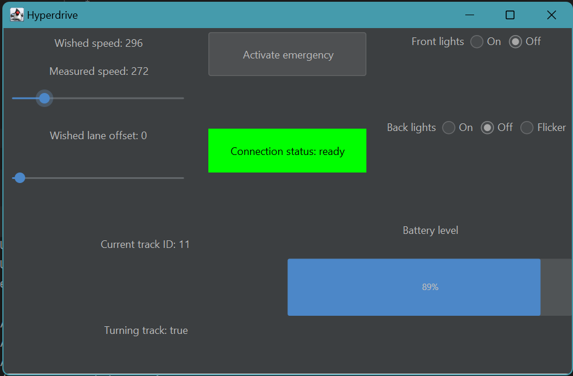

# **Overview**

This project utilizes the MQTT protocol for communication with the Anki Hyperdrive vehicle and provides a graphical user interface (GUI) that allows users to interact with a remote-controlled vehicle.

# **Features**

-  Choose which vehicle you want to connect to
-  **_Emergency Flag Control:_** Toggle the emergency flag to enable or disable emergency stops.
-  **_Velocity and Acceleration Control:_** Adjust the velocity and acceleration of the vehicle using sliders in the GUI. The acceleration control is available only in the Python implementation.
-  **_Lane Change:_** Change lanes to the left or right, with options to modify offset, velocity, and acceleration.
-  **_Lights Control:_** Turn the vehicle lights on or off.
-  **_Track Information:_** Retrieve the trackId on which the vehicle runs currently and estimate if it is a turning track or not.
-  **_Battery Level Information:_** Retrieve the battery level and limit speed if the battery level is too low

TODO: ADD REST OF THE FEATURES

# Dependencies & Usage

## For the Python script:
    
  **Install Dependencies:**
    ```
    pip install paho-mqtt ttkbootstrap
    ```

  **Run the Script:**
    ```
    python3 pymqtt.py
    ```
    
  **GUI Interface:**
   - Toggle the emergency flag using the "Toggle Emergency Flag" button.
   - Adjust velocity and acceleration using the sliders.

**Threads:**

- **_Emergency Thread (emergency_thread):_**
        Responsible for running the emergency_stop_process() function, which continuously checks the emergency_flag and takes appropriate actions if an emergency is detected.
        Handles emergency situations, such as stopping the vehicle and blinking lights.

- **_Tkinter Thread (tkinter_thread):_**
        Responsible for running the Tkinter GUI using the run_tkinter() function.
        Manages the GUI window and provides an interface for user interactions.

- **_Main Thread:_**
        The main thread starts the MQTT client loop (client.loop_start()).
        Handles the connection to the MQTT broker, subscription to topics, and initial payload publication.
        Manages the cleanup process when the script exits (cleanup() function is registered with atexit).
  

**Clean Up:**
   - The script will automatically disconnect from the MQTT broker and stop the threads when it exits.

**Known Issues:**


## For the Java program:
**Prerequisites**: Ensure JDK and Apache Maven are installed.

**Compile the project**: 
* In a terminal, navigate to the directory containing the ``pom.xml`` file and ``src`` directory
* Run the following bash command: ``mvn clean install`` to compile code.

**Run the code**:
* In the ``Main`` file, choose the ``vehicleId`` among the provided list
* Run the ``Main`` file
* Play with the GUI interface (cf. below)

**Threads**: For this Java implementation, after discovering and connecting to the vehicle, two Threads are used:

- **_Steering Thread:_** Used to control the vehicle speed, lane, lights and toggle emergency flag.
  
- **_VehicleInfo Thread:_** Used to retrieve information about the vehicle status: on which track it is, if it is a turning track, the measured speed and the battery level.

**GUI Interface:**

* Two sliders to control the speed and the lane offset on the circuit
* Radio buttons to control lights
* A toggle button to activate or deactivate emergency. 
  * When activating emergency flag, the speed and lane offset sliders min and max values are set to 0 and the vehicle stops.
  * When deactivating emergency flag, the vehicle should begin again at wished speed.
* Information about current track id and estimation if it is a turning track, as well as battery level are displayed.
  * In case of low battery, a message displays to inform the user that the speed has been reduced because of low battery.
    

**Known Issues:**
* The battery topic from vehicles is not really reliable. It never goes below 75 (on a scale from 0 to 100), even in case battery is fast empty. 
Hence, the "low battery" feature is never activated.
* In case of two programs controlling the same vehicle, if the other program activates emergency, it is not detected by Java implementation. 
In order to include this feature, Java implementation should add a subscription to an "emergency topic" and also publish on this topic when activating/deactivating emergency flag.

